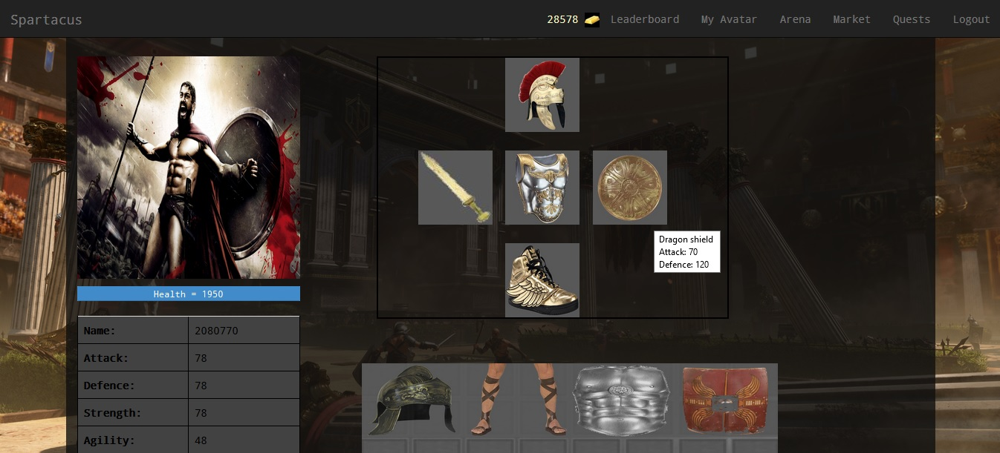
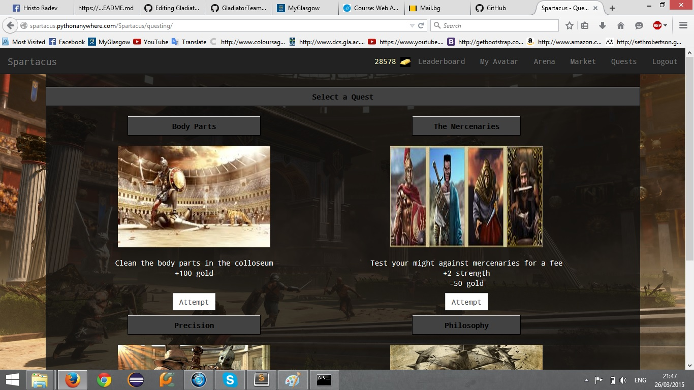
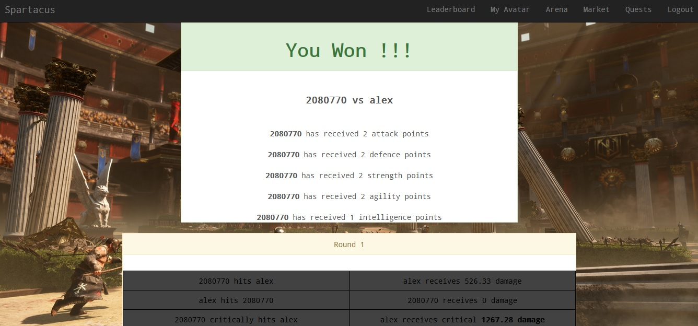

# Spartacus

Browser based RPG game, where you can fight on the arena  
with other gladiators. You can equip your gladiator with  
authentic ancient weapons, get stronger and become the best  
among the gladiators.

The app can be found [Here] (http://spartacus.pythonanywhere.com)

### Features
- Items that can be equipped and unequipped
- Inventory for the items
- Market to buy and sell items
- Arena where you can fight with other gladiators
- Quests - another way for earning gold and stats.

### Installation instructions

- First: Clone the repository 
    git clone https://github.com/ivanganchev93/GladiatorTeamProject.git 
    
- Second: Go to ./GladiatorTeamProject, create a virtual environment for the app and switch to it 
    cd GladiatorTeamProject 
    mkvirtualenv Spartacus 
    workon Spartacus 
    
- Third: Install the dependencies 
    pip install -r requirements.txt 
    
- Forth: Make the migrations, migrate, run the population script and launch the server 
    cd GladiatorTeamProject 
    python manage.py makemigrations Spartacus 
    python manage.py migrate 
    python populate_spartacus.py 
    python manage.py runserver 
    
- Fifth: Login 
    Type the following in your web browser: 127.0.0.1:8000/Spartacus 
    Register or login with the test account - username: test password: test 
  
- Finally: Have Fun! 
    This part is mandatory 

### Screenshots

#### Avatar view

#### Quests

#### Battle

